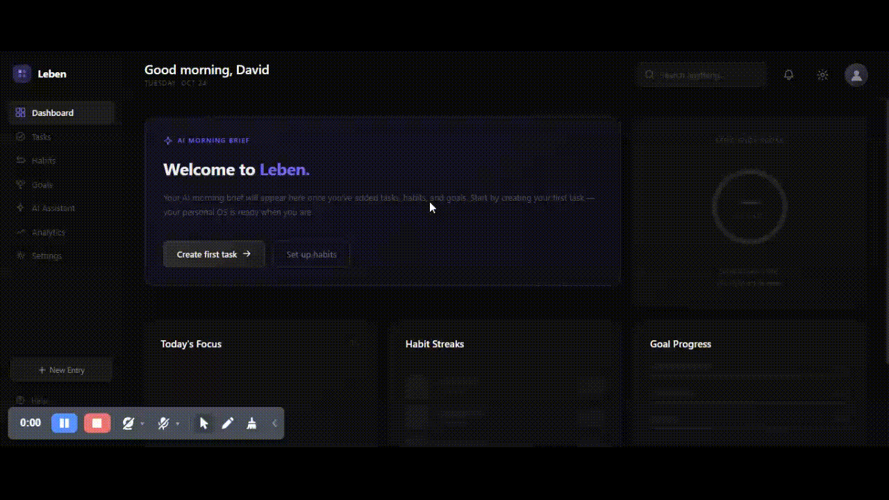

<div align="center">


<br />
<br />

# ✦ Leben

### Your personal life OS. Built with a Neural Engine.

_Leben (German for "life") is a modular productivity ecosystem that combines task management, habit tracking, and goal setting into an AI-powered system designed for strictly bounded execution._



[Live Demo](https://leben-os.vercel.app) · [Report a Bug](https://github.com/DavidOG03/Leben/issues) · [Request a Feature](https://github.com/DavidOG03/Leben/issues)

</div>

---

## What is Leben?

Most productivity apps do one thing well. You end up with a task app here, a habit tracker there, a notes app somewhere else — and none of them talk to each other.

Leben is built around the idea that your tasks, habits, goals, and daily plan should inform each other via a **Neural Engine**. The AI layer doesn't just "chat"—it reads your live context and helps you execute with mathematical precision.

---

## Features

### ✦ Neural Daily Planner
Powered by Gemini 2.5 Flash, the planner reads your actual tasks, habits, and goals to generate a time-blocked itinerary. It optimizes for your energy peaks and metabolic discipline, updating as your data changes.

### ✦ Neural Assistant
A strictly-bounded AI assistant specifically informed by your personal productivity data. It doesn't give generic advice; it helps you navigate *your* specific workload.

### ✓ Task Management
Advanced Kanban-style boards with tags (`WORK` / `PERSONAL`), priority levels, and reminder notifications.

### ◎ Habit Tracking
Build discipline with streak counting, completion history, and a commitment matrix to visualize consistency.

### ◈ Goals
Set and track progress on long-term goals. The AI layer surfaces your goals in the assistant and planner to keep you aligned with your primary objectives.

### ◉ Analytics
Deep-dive into your productivity patterns with visual breakdowns of completion rates and streak data derived from real time-series data.

---

## Tech Stack

| Layer            | Technology                                |
| ---------------- | ----------------------------------------- |
| Framework        | Next.js 14 (App Router)                   |
| Language         | TypeScript                                |
| Styling          | Tailwind CSS                              |
| State Management | Zustand (slice architecture)              |
| Auth + Database  | Supabase (Auth, PostgreSQL, RLS)          |
| AI Engine        | Multi-provider (Gemini 2.5, DeepSeek, Groq) |
| Deployment       | Vercel                                    |

---

## Architecture Decisions Worth Knowing

**Unified AI Client** — Gemini, DeepSeek, and Groq are unified into a single resilient client with automatic failover logic. No feature is coupled to a single model.

**Strict Context Bounding** — Context builders aggregate your live tasks, habits, and goals before every AI call, ensuring the "Neural Engine" is always grounded in your specific reality.

**Neural Lock Infrastructure** — Sensitive routes (AI, Planner) use high-fidelity "Lock Screens" for unauthenticated users, maintaining the app aesthetic while ensuring data security.

**Standardized UI Pattern** — All icons are centralized in a type-safe library, and components follow a strict Tailwind-first utility pattern for rapid iteration and visual consistency.

---

## Project Structure

```
leben/
├── app/
│   ├── auth/
│   │   ├── signin/
│   │   ├── signup/
│   │   ├── signout/
│   │   └── callback/      # OAuth + email confirmation handler
│   ├── dashboard/
│   ├── tasks/
│   ├── habits/
│   ├── goals/
│   ├── planner/
│   ├── analytics/
│   └── ai/
├── components/
│   ├── auth/              # SignInForm, SignUpForm, AuthHeroPanel, etc.
│   ├── planner/           # Timeline, AIInsightsCard, EnergyDistribution, etc.
│   ├── habits/
│   ├── goals/
│   └── analytics/
├── lib/
│   ├── supabase/
│   │   ├── client.ts      # Browser client
│   │   ├── server.ts      # Server client
│   │   ├── middleware.ts  # Session refresh
│   │   ├── db.ts          # All database operations
│   └── ai/
│       ├── unifiedClient.ts  # Multi-provider AI core
│       ├── contextBuilder.ts # Live user data aggregation
│       └── aiPlanner.ts      # Specialized Planner logic
├── store/
│   ├── useStore.ts        # Root store composition
│   ├── goalSlice.ts
│   └── bookSlice.ts
└── hooks/
    ├── useAuthSync.ts
    └── useLoadUserData.ts
```

---

## Getting Started

### Prerequisites

- Node.js 18+
- A [Supabase](https://supabase.com) project
- A [Google AI Studio](https://aistudio.google.com) API key

### Installation

```bash
# Clone the repo
git clone https://github.com/DavidOG03/Leben.git
cd Leben

# Install dependencies
npm install

# Set up environment variables
cp .env.example .env.local
```

Fill in your `.env.local`:

```env
NEXT_PUBLIC_SUPABASE_URL=your_supabase_project_url
NEXT_PUBLIC_SUPABASE_ANON_KEY=your_supabase_anon_key
GEMINI_API_KEY=your_gemini_api_key
```

### Database Setup

Run the following in your Supabase SQL editor to create the tables and enable Row Level Security:

```sql
-- Tasks
create table tasks (
  id text primary key,
  user_id uuid references auth.users(id) on delete cascade not null,
  title text not null,
  completed boolean default false,
  tag text check (tag in ('WORK', 'PERSONAL')),
  priority text check (priority in ('high', 'medium', 'low')) default 'medium',
  category text,
  date text,
  created_at timestamp with time zone default now(),
  completed_at timestamp with time zone,
  reminder_at timestamp with time zone
);

-- Habits
create table habits (
  id text primary key,
  user_id uuid references auth.users(id) on delete cascade not null,
  name text not null,
  streak integer default 0,
  longest_streak integer default 0,
  checked boolean default false,
  color text,
  completed_dates text[] default '{}',
  reminder_at timestamp with time zone
);

-- Goals
create table goals (
  id text primary key,
  user_id uuid references auth.users(id) on delete cascade not null,
  title text not null,
  progress integer default 0,
  status text default 'active',
  created_at timestamp with time zone default now()
);

-- Books
create table books (
  id            text primary key,
  user_id       uuid references auth.users(id) on delete cascade not null,
  title         text not null,
  author        text not null,
  current_page  integer default 0,
  total_pages   integer not null,
  cover_color   text,
  status        text check (status in ('reading', 'completed', 'paused')) default 'reading',
  added_at      bigint not null
);


-- Enable RLS
alter table tasks  enable row level security;
alter table habits enable row level security;
alter table goals  enable row level security;

-- Policies (repeat for habits and goals)
create policy "Users manage their own tasks"
  on tasks for all using (auth.uid() = user_id);
```

```bash
# Run the development server
npm run dev
```

Open [http://localhost:3000](http://localhost:3000).

---

## Roadmap

- [x] Authentication (email/password, Google OAuth, GitHub OAuth)
- [x] Task management with priorities and tags
- [x] Habit tracking with streaks
- [x] Goals module with progress tracking
- [x] AI-powered daily planner (Gemini)
- [x] AI morning brief
- [x] Analytics dashboard
- [x] Supabase database integration
- [ ] Mobile-responsive polish
- [ ] Notifications and reminders
- [ ] AI-suggested habits based on goals
- [ ] Weekly AI review and retrospective
- [ ] Collaborative goals (share progress with accountability partner)
- [ ] Mobile app (React Native)

---

## Contributing

Leben is being built in public. If you have ideas, find bugs, or want to contribute:

1. Fork the repo
2. Create a feature branch (`git checkout -b feature/your-idea`)
3. Commit your changes (`git commit -m 'add: your feature'`)
4. Push to the branch (`git push origin feature/your-idea`)
5. Open a Pull Request

---

## Author

**David OG** — building Leben in public

Follow the build on [Twitter/X](https://twitter.com/Deiveed0) · [LinkedIn](https://linkedin.com/in/david-ogungbemi-7455551b5/)

---

<div align="center">

Built with focus. Designed for execution.

**⭐ Star this repo if Leben resonates with you**

</div>
